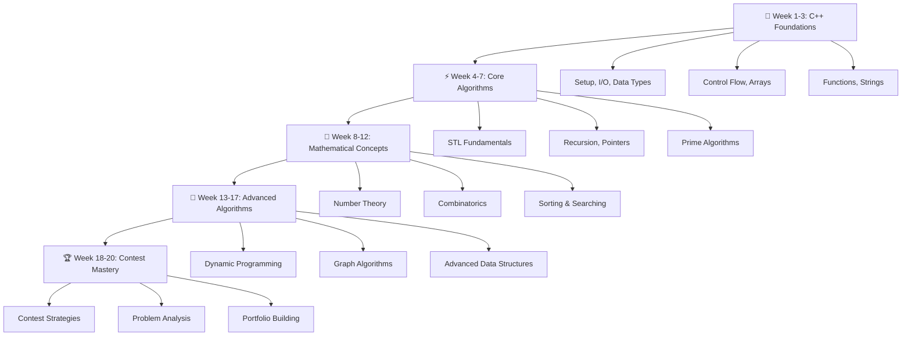

# 🚀 **C++ & Mathematical Algorithms for Competitive Programming**

<div align="center">


**🎯 Transform from C++ beginner to competitive programming champion!**


[]()
[]()
[]()

</div>

---

## 📖 **Table of Contents**

- [🌟 Course Overview](#-course-overview)
- [🗺️ Course Roadmap](#️-course-roadmap)
- [🚀 Getting Started](#-getting-started)
- [📋 Week-by-Week Breakdown](#-week-by-week-breakdown)
- [🛠️ Tools & Resources](#️-tools--resources)
- [🤝 Contributing](#-contributing)

---

## 🌟 **Course Overview**

This repository contains a **comprehensive 20-week course** designed to take you from C++ fundamentals to competitive programming mastery.

### **📅 Course Structure**
- **Duration:** 20 weeks total
- **Study Schedule:** 5 days per week
- **Daily Commitment:** ~1.5 hours (Theory + Practice)

### **🎯 Goals**
- ✨ Build expert-level C++ foundation
- 🧮 Master mathematical algorithms for competitive programming
- 🏆 Develop contest-level problem-solving skills

---

## 🗺️ **Course Roadmap**

<div align="center">



</div>

---

## 🚀 **Getting Started**

### **🔧 Prerequisites**
- 💻 A computer with C++ compiler (GCC, Clang, or MSVC)
- 🎯 Motivation to learn and practice regularly
- ⏰ 1.5 hours daily commitment

### **⚙️ Setup Instructions**

1. **📥 Clone the Repository**
   ```bash
   git clone https://github.com/LazyFrog100/cpp.git
   cd cpp
   ```

2. **🛠️ Install C++ Development Environment**
   - **VS Code:** Install C++ extensions
   - **CLion:** JetBrains IDE for C++

3. **📖 Start Learning**
   - Read `Routine.md` for complete overview
   - Take the interactive quiz after completing each week

---

## 📋 **Week-by-Week Breakdown**

<details>
<summary><strong>🗓️ Weeks 1-5: Foundation Building</strong></summary>

| Week | Focus Area | Key Topics | Deliverables |
|------|------------|------------|--------------|
| **1** | 🖥️ **C++ Foundations** | Setup, I/O, Data Types, Operators | ✅ First program, Quiz completion |
| **2** | 🔀 **Control Flow** | Conditions, Loops, Basic Math | ✅ Control flow mastery |
| **3** | 📚 **Arrays & Functions** | 1D/2D Arrays, Function basics | ✅ Array manipulation skills |
| **4** | 📝 **Strings & Primes** | String operations, Prime algorithms | ✅ String processing + Sieve |
| **5** | 🔄 **GCD/LCM & Recursion** | Euclidean algorithm, Recursion | ✅ Mathematical foundations |

</details>

<details>
<summary><strong>⚡ Weeks 6-10: Algorithmic Foundation</strong></summary>

| Week | Focus Area | Key Topics | Deliverables |
|------|------------|------------|--------------|
| **6** | 🏗️ **STL & Modular Arithmetic** | Vector, pair, Fast exponentiation | ✅ STL proficiency |
| **7** | 👉 **Pointers & Advanced STL** | Memory management, Containers | ✅ Advanced data structures |
| **8** | 🔢 **Combinatorics** | Permutations, Combinations, nCr | ✅ Mathematical counting |
| **9** | 🔀 **Sorting Algorithms** | All major sorting techniques | ✅ Sorting mastery |
| **10** | 🔎 **Searching & Binary Search** | Linear, Binary, Ternary search | ✅ Search optimization |

</details>

<details>
<summary><strong>🧮 Weeks 11-15: Advanced Concepts</strong></summary>

| Week | Focus Area | Key Topics | Deliverables |
|------|------------|------------|--------------|
| **11** | 🔣 **Bit Manipulation** | Bitwise operations, Bitmasks | ✅ Bit-level programming |
| **12** | 💡 **Greedy Algorithms** | Greedy strategy, Optimization | ✅ Greedy problem solving |
| **13** | 🧠 **Dynamic Programming** | DP fundamentals, Classic problems | ✅ DP mastery |
| **14** | 🎭 **Advanced DP** | Bitmask DP, Digit DP | ✅ Complex DP patterns |
| **15** | 🌳 **Trees** | Tree algorithms, Traversals | ✅ Tree data structures |

</details>

<details>
<summary><strong>🏆 Weeks 16-20: Expert Level</strong></summary>

| Week | Focus Area | Key Topics | Deliverables |
|------|------------|------------|--------------|
| **16** | 🕸️ **Graph Theory** | BFS, DFS, Basic graphs | ✅ Graph fundamentals |
| **17** | 🛣️ **Advanced Graphs** | Shortest paths, MST | ✅ Graph algorithms |
| **18** | 🔗 **Union-Find** | DSU, Advanced graph topics | ✅ Advanced graph structures |
| **19** | 📊 **Advanced Topics** | Segment trees, Fenwick trees | ✅ Range query structures |
| **20** | 🏁 **Contest Mastery** | Strategies, Mock contests | ✅ Competition readiness |

</details>

---

## 🛠️ **Tools & Resources**

### **💻 Essential Development Tools**
-  **VS Code** with C++ extensions
-  **CLion** JetBrains IDE
-  **GCC/G++** compiler

### **🌐 Online Judges & Platforms**
-  **Codeforces**
-  **CodeChef**
-  **LeetCode**
-  **AtCoder**


---

## 🤝 **Contributing**

We welcome contributions to improve this course! Here's how you can help:

### **🔧 How to Contribute**
1. **🍴 Fork** the repository
2. **🌿 Create** a feature branch (`git checkout -b feature/AmazingFeature`)
3. **💻 Commit** your changes (`git commit -m 'Add some AmazingFeature'`)
4. **📤 Push** to the branch (`git push origin feature/AmazingFeature`)
5. **📋 Open** a Pull Request

### **🎯 Contribution Areas**
- 📝 **Content:** Add practice problems, improve explanations
- 🧪 **Assessments:** Create new quizzes and challenges
- 🎨 **Design:** Improve visual design and user experience
- 🐛 **Bug Fixes:** Report and fix issues
- 📚 **Documentation:** Enhance README and course materials

---

<div align="center">

## ⭐ **Show Your Support**

If this course helps you in your competitive programming journey, please consider:

[](https://github.com/LazyFrog100/cpp)
[](https://github.com/LazyFrog100/cpp/fork)
[](https://github.com/LazyFrog100/cpp)

---

**📧 Questions?** Open an issue or start a discussion!  
**🎯 Ready to start?** let's code together! 🚀

**🚀 Happy Coding and Best of Luck in Your Competitive Programming Journey! 🚀**

---

*| Made with ❤️ for the competitive programming community |*

</div> 
